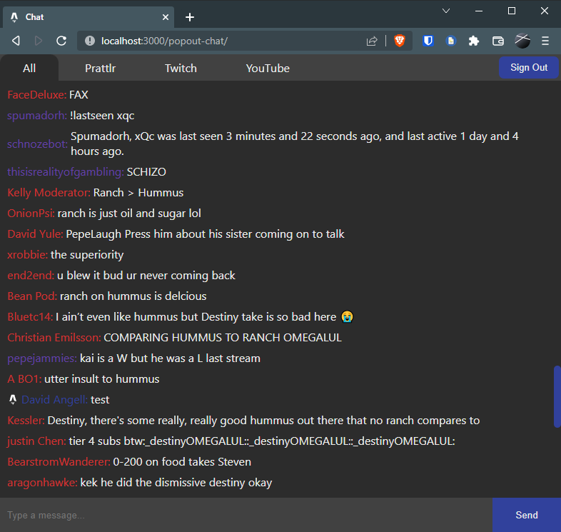

<div id="top"></div>

[![Contributors][contributors-shield]][contributors-url]
[![Stargazers][stars-shield]][stars-url]
[![Issues][issues-shield]][issues-url]
[![MIT License][license-shield]][license-url]
<!-- [![Forks][forks-shield]][forks-url] -->


<!-- TABLE OF CONTENTS -->
<details>
  <summary>Table of Contents</summary>
  <ol>
    <li>
      <a href="#about-the-project">About The Project</a>
      <ul>
        <li><a href="#overview">Overview</a></li>
        <li><a href="#built-with">Built With</a></li>
        <li><a href="#roadmap">Roadmap</a></li>
      </ul>
    </li>
    <li><a href="#usage">Usage</a></li>
    <li><a href="#contributing">Contributing</a></li>
    <li><a href="#license">License</a></li>
    <li><a href="#contact">Contact</a></li>
    <li><a href="#acknowledgments">Acknowledgments</a></li>
  </ol>
</details>


<!-- ABOUT THE PROJECT -->
## About The Project

### Overview 

Prattlr is a multi-chat application that allows streamers to connect with their viewers accross Twitch and YouTube. It is **NOWHERE NEAR** production ready, but it is a work in progress.



### Built With

* [Next.js](https://nextjs.org/)
* [Astro](https://astro.build/)
* [React](https://reactjs.org/)
* [Firebase](https://firebase.google.com/)
* [Socket.IO](https://socket.io/)
* [twurple](https://twurple.js.org/)

### Roadmap
- [x] Create chat front end
- [x] Create embeded chat for OBS
- [x] Integrate with Twitch.tv chat
- [x] Integrate with YouTube chat
- [x] Add Firebase authentication
- [x] Add Firebase database for chat logs
- [ ] Add logs viewer
- [ ] Add moderation tools
- [ ] Add chat badges and name colors
- [ ] Add custom handles
- [ ] Add chat commands
- [ ] Get BetterTTV and FrankerFaceZ emotes working
- [ ] Add custom emotes


<p align="right">(<a href="#top">back to top</a>)</p>

## Usage
1. Clone the repo
    ```bash
    git clone https://github.com/DavidAngell/Prattlr
    cd Prattlr
    ```

2. Create server/src/credentials.ts
      ```ts
    // Firebase auth
    export const FIREBASE_SERVICE_ACCOUNT = {
      "type": "",
      "project_id": "",
      "private_key_id": "",
      "private_key": "",
      "client_email": "",
      "client_id": "",
      "auth_uri": "",
      "token_uri": "",
      "auth_provider_x509_cert_url": "",
      "client_x509_cert_url": ""
    };
    ```

3. Start the server
    ```bash
    cd server
    npm run start
    ```

4. Start the client
    ```bash
    cd client
    npm run dev
    ```
5. Open [http://localhost:3000](http://localhost:3000) in your browser of choice

<p align="right">(<a href="#top">back to top</a>)</p>
    

<!-- CONTRIBUTING -->
## Contributing

Contributions are what make the open source community such an amazing place to learn, inspire, and create. Any contributions you make are **greatly appreciated**.

If you have a suggestion that would make this better, please fork the repo and create a pull request. You can also simply open an issue with the tag "i did john's mom".

1. Fork the Project
2. Create your Feature Branch (`git checkout -b feature/AmazingFeature`)
3. Commit your Changes (`git commit -m 'Add some AmazingFeature'`)
4. Push to the Branch (`git push origin feature/AmazingFeature`)
5. Open a Pull Request

<p align="right">(<a href="#top">back to top</a>)</p>


<!-- LICENSE -->
## License

Distributed under the MIT License. See `LICENSE.txt` for more information.

<p align="right">(<a href="#top">back to top</a>)</p>


<!-- CONTACT -->
## Contact

David Angell - [@DavidJAngell42](https://twitter.com/DavidJAngell42) - contact@davidangell.dev

<p align="right">(<a href="#top">back to top</a>)</p>


<!-- ACKNOWLEDGMENTS -->
## Acknowledgments

* [This Legend](https://www.youtube.com/watch?v=dQw4w9WgXcQ)


<div align="center">
	<br />
	<a href="https://paypal.me/davidjangell" align="center" target="_blank">
		
	</a>
</div>


<!-- MARKDOWN LINKS & IMAGES -->
<!-- https://www.markdownguide.org/basic-syntax/#reference-style-links -->
[contributors-shield]: https://img.shields.io/github/contributors/DavidAngell/Prattlr.svg?style=for-the-badge
[contributors-url]: https://github.com/DavidAngell/Prattlr/graphs/contributors
[forks-shield]: https://img.shields.io/github/forks/DavidAngell/Prattlr.svg?style=for-the-badge
[forks-url]: https://github.com/DavidAngell/Prattlr/network/members
[stars-shield]: https://img.shields.io/github/stars/DavidAngell/Prattlr.svg?style=for-the-badge
[stars-url]: https://github.com/DavidAngell/Prattlr/stargazers
[issues-shield]: https://img.shields.io/github/issues/DavidAngell/Prattlr.svg?style=for-the-badge
[issues-url]: https://github.com/DavidAngell/Prattlr/issues
[license-shield]: https://img.shields.io/github/license/DavidAngell/Prattlr.svg?style=for-the-badge
[license-url]: https://github.com/DavidAngell/Prattlr/blob/master/LICENSE.txt